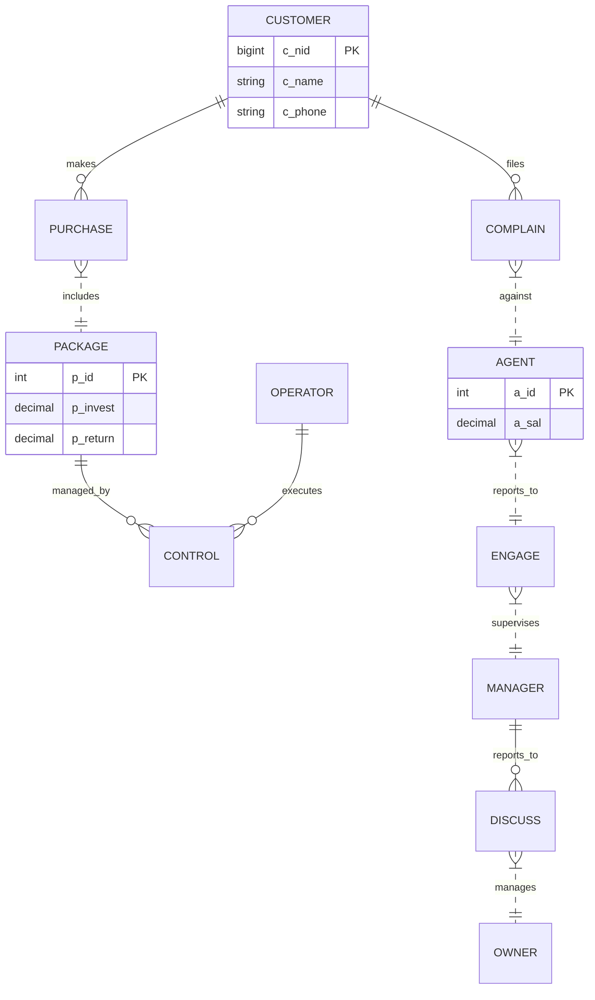

# 🏢 CIMS: Crypto Investment Management System

[](https://www.python.org/ )
[](https://streamlit.io/ )
[](https://www.mysql.com/ )
[]()

**A Full-Stack Enterprise Database Solution for Fintech Management.**

---

## 📖 Project Overview
The **Crypto Investment Management System (CIMS)** is a robust database application designed to streamline the operations of a modern investment firm. It replaces decentralized manual records with a centralized SQL architecture, enabling real-time tracking of:
* **Investor Portfolios** (Silver, Gold, Platinum Packages)
* **Staff Hierarchy** (Owners $\to$ Managers $\to$ Agents)
* **Operational Logistics** (Operator assignments and locations)

The system includes a **live interactive dashboard** built with Streamlit, allowing executives to visualize ROI, payroll expenses, and customer demographics without writing SQL queries.

---

## ⚙️ Technical Architecture

### 🛠 Tech Stack
* **Database Engine:** MySQL 8.0 (Relational Schema)
* **Backend Interface:** Python 3.9 + `mysql-connector-python`
* **Frontend GUI:** Streamlit (Web-based Dashboard)
* **Data Analysis:** Pandas (DataFrame manipulation)

### 📊 Database Schema (ER Diagram)
*GitHub renders this automatically:*



## 🚀 Key Features
1. Executive Dashboard
   - Real-time KPIs: Instantly view Total Capital Invested, Active Customer Count, and Staff size.
   - Visual Analytics: Bar charts showing investment distribution and operator geographical locations.
2. Master Database Access
   - CRUD Operations: Full view access to all 6 departmental tables (Customer, Manager, Agent, Owner, Package, Operator).
   - Search Engine: Built-in search functionality to find investors by name dynamically.
3. Strategic Reporting (SQL Views)
   - 💰 ROI Analysis: Automated join of Control and Package tables to calculate profit margins.
   - 💸 Payroll Audit: Aggregation view (v21) calculating total monthly salary liabilities.
   - 👔 Managerial Audit: Self-join analysis of the management hierarchy.

## 🔧 Installation & Setup
1. Clone the Repository
   ```bash
   git clone https://github.com/YOUR_USERNAME/CIMS_System.git
   cd CIMS_System
   ```
2. Install Dependencies
   ```bash
   pip install -r requirements.txt
   ```
3. Setup Database
   - Open MySQL Workbench.
   - Open database.sql and click the Lightning Bolt ⚡ to build the schema.
4. Launch the Dashboard
   ```bash
   python3 -m streamlit run app.py
   ```

## 📂 Project Structure
```
CIMS_System/
├── app/
│   └── app.py              # Dashboard Code
├── database/
│   └── database.sql        # Database Script
└── requirements.txt        # Dependencies  
```
